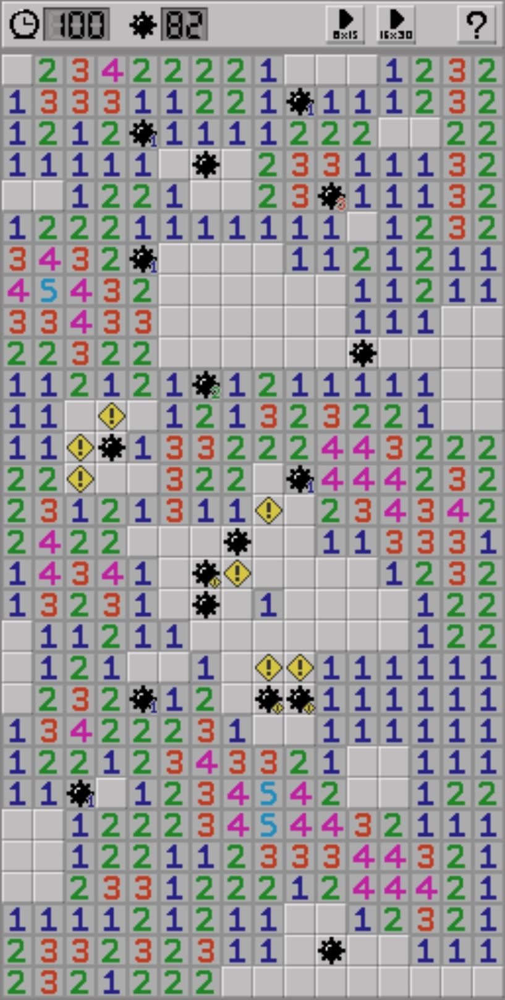

Mineplacer
==========

This is a browser game inspired by Minesweeper.

You are the person preparing for a game of Minesweeper by placing mines!

[Play!](https://sile.github.io/mineplacer/)

How to Play
-----------

- Select a game level (8x15 or 16x30).
- Click on a cell to place a mine there.
- A digit in a cell indicates the number of mines that should be placed around the cell (including the cell itself).
- :warning: mark indices there are too many mines around the cell.
- The condition for winning is that all mines are placed in the correct positions.

